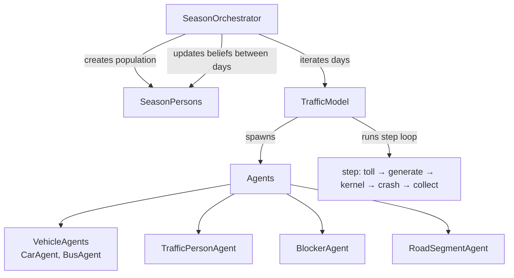
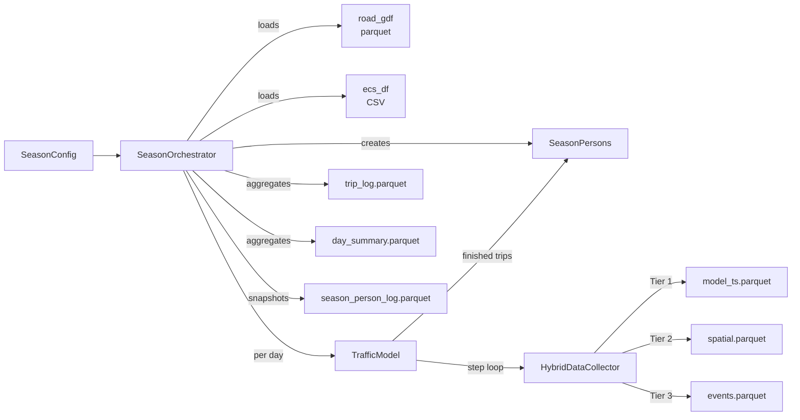

# System Overview

The simulation is organized into three layers: season orchestration, daily model execution, and agent-level behavior.

---

## Three-Layer Hierarchy

---

## Season Layer

**Directory:** `season/`

| File | Responsibility |
|------|---------------|
| `configs.py` | `SeasonConfig`, `DayParams`, `PopulationParams`, `ScheduleSpecs`, `make_season_config()` |
| `persons.py` | `SeasonPerson` dataclass -- traits, history, belief computation |
| `season_orchestrator.py` | `SeasonOrchestrator` -- runs days, persists outputs, manages population |

The season layer creates the population **once**, then runs each day's `TrafficModel` in sequence. Between days, it calls `update_beliefs_from_history()` on every `SeasonPerson` so that travel experience from day N informs mode choice on day N+1.

Outputs are persisted to `data/season_outputs/<season_id>/` as parquet files and JSON.

---

## Day / Model Layer

**Directory:** `traffic/model/`

| File | Responsibility |
|------|---------------|
| `traffic_model.py` | `TrafficModel` (Mesa Model subclass) -- core simulation loop |
| `generate.py` | Person spawning, bus dispatch, crash/closure generation |
| `init_helpers.py` | Road segment initialization, numpy array pre-computation |
| `tolling.py` | Signal → Transform → TollConfig composition |
| `hybrid_collector.py` | 4-tier data collection system |

One `TrafficModel` instance is created per simulated day. It manages agent lists, the vehicle store, data collection, and the step loop. See [TrafficModel Lifecycle](traffic-model-lifecycle.md) for the step-by-step execution order.

---

## Agent Layer

**Directory:** `traffic/agents/`

| File | Agent | Type |
|------|-------|------|
| `vehicle_agent.py` | `VehicleAgent` | Base class for cars and buses |
| `car_agent.py` | `CarAgent` | Private vehicle with randomized driver traits |
| `bus_agent.py` | `BusAgent` | Fixed-route transit with conservative parameters |
| `traffic_person_agent.py` | `TrafficPersonAgent` | Mode choice, trip tracking, belief handoff |
| `blocker_agent.py` | `BlockerAgent` | Temporary road obstruction (crash/closure) |
| `road_segment_agent.py` | `RoadSegmentAgent` | Static road waypoint with speed limit and curvature |

See [Agent Taxonomy](agent-taxonomy.md) for detailed descriptions.

---

## Utility Layer

**Directory:** `traffic/utils/`

| File | Contents |
|------|----------|
| `unit_conversion_utils.py` | mph/mps conversion, distance conversions, time-of-day helpers |
| `distribution_utils.py` | Truncated normal distribution factory (`make_truncnorm`) |
| `analysis_utils.py` | Post-run analysis helpers |
| `animation_utils.py` | Animation rendering from Tier 2 spatial data |

---

## Data Flow

---

## External Data

**Directory:** `collect_external_data/`

| Script | Produces |
|--------|----------|
| `road_geom.py` | `data/roads/hw210_sl_and_curvs.parquet` -- road geometry with speed limits and curvature |
| `expected_counts.py` | `data/vehicle_counts/expected_counts_seconds.csv` -- empirical vehicle arrival rates by percentile |

These are downloaded/generated on first use and cached locally.
