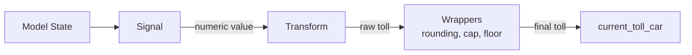

# Tolling System

The tolling system uses a composable **Signal → Transform → TollConfig** architecture defined in `traffic/model/tolling.py`. This allows mixing and matching signal sources with pricing strategies.

---

## Architecture



- **Signal**: Reads model state, returns a number (or `None` if not ready)
- **Transform**: Maps the signal value to a raw toll amount
- **TollConfig**: Ties signal + transform together with universal wrappers and cadence control

---

## Built-In Signals

### VolumeSignal

Returns the current number of vehicles on the road.

```python
VolumeSignal()
# Returns: len(model.vehicles_list)
```

Always returns a value immediately. Useful for congestion-responsive tolling.

### FlowSignal

Returns a rolling average of vehicle arrivals per step.

```python
FlowSignal(window_steps=300)  # 5-minute window at 1 step/sec
# Returns: average new vehicles per step over the window
# Returns None until the window is full
```

Tracks the difference in cumulative vehicle count (`car_counter + bus_counter`) between steps. The rolling window smooths out step-to-step noise.

---

## Built-In Transforms

### PiecewiseLinearTransform

Linear toll above a threshold:

```python
PiecewiseLinearTransform(threshold=100, slope=0.05, base=5.0)
# signal <= 100: toll = $0
# signal > 100:  toll = $5.00 + $0.05 * (signal - 100)
```

### StepTransform

Binary on/off toll:

```python
StepTransform(threshold=100, toll=10.0)
# signal <= 100: toll = $0
# signal > 100:  toll = $10.00
```

### PITransform

Proportional-integral feedback controller that drives the signal toward a target:

```python
PITransform(
    target=30,            # desired signal level
    kp=0.5,               # proportional gain
    ki=0.05,              # integral gain
    toll_min=0.0,         # minimum toll
    toll_max=50.0,        # maximum toll
    reset_integral_on_target=True  # reset integral when signal <= target
)
```

When `reset_integral_on_target=True` (default), the toll drops to `toll_min` as soon as congestion falls to or below the target. This prevents the toll from persisting at elevated levels once congestion is controlled.

Includes **anti-windup clamping** to prevent the integral term from accumulating beyond what would produce `toll_max`.

---

## TollConfig

The top-level configuration object:

```python
@dataclass
class TollConfig:
    signal: Any = None              # callable(model) -> float | None
    transform: Any = None           # callable(signal) -> float
    update_every_n_steps: int = 1   # recalculation cadence
    rounding: float = None          # round to nearest increment (e.g., 0.10)
    cap: float = None               # maximum toll
    floor: float = None             # minimum nonzero toll
```

### Wrapper behavior

Wrappers are applied in order after the transform:

1. **Floor**: If toll > 0, enforce minimum: `toll = max(toll, floor)`
2. **Cap**: Enforce maximum: `toll = min(toll, cap)`
3. **Rounding**: Round to nearest increment: `round(toll / increment) * increment`

### Static toll shortcut

For fixed-price tolls with no signal or transform:

```python
TollConfig.static(car=10.0)
```

### Reset between days

`TollConfig.reset()` reinitializes signal and transform state for a new day. This clears the `FlowSignal`'s rolling window, the `PITransform`'s integral accumulator, etc.

---

## Integration with TrafficModel

`update_tolls()` is called at the **start** of each step:

1. If static toll: return the fixed value (no computation)
2. Cadence check: skip if not at the `update_every_n_steps` boundary
3. Get signal value: call `signal(model)` -- if `None`, keep previous toll
4. Apply transform: `raw_toll = transform(signal)`
5. Apply wrappers: floor → cap → rounding
6. Update `model.current_toll_car`

New cars pay whatever `current_toll_car` is at their creation step.

---

## Example Configurations

### 1. Static toll

```python
toll=TollConfig.static(car=10.0)
```

### 2. Volume-based piecewise linear

```python
toll=TollConfig(
    signal=VolumeSignal(),
    transform=PiecewiseLinearTransform(threshold=100, slope=0.05, base=5.0),
    update_every_n_steps=60,
    rounding=0.25,
)
```

### 3. Flow-based piecewise linear

```python
toll=TollConfig(
    signal=FlowSignal(window_steps=300),
    transform=PiecewiseLinearTransform(threshold=1.0, slope=10.0, base=2.0),
    update_every_n_steps=60,
    rounding=0.25,
    cap=25.0,
)
```

### 4. Volume-based step toll

```python
toll=TollConfig(
    signal=VolumeSignal(),
    transform=StepTransform(threshold=100, toll=10.0),
    update_every_n_steps=60,
)
```

### 5. Volume-based PI controller

```python
toll=TollConfig(
    signal=VolumeSignal(),
    transform=PITransform(target=300, kp=0.5, ki=0.05, toll_min=0, toll_max=50),
    update_every_n_steps=60,
    rounding=0.10,
)
```
